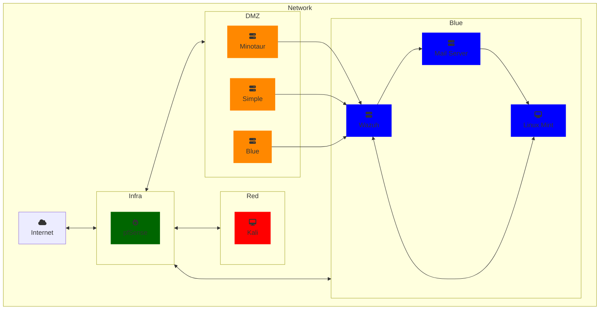
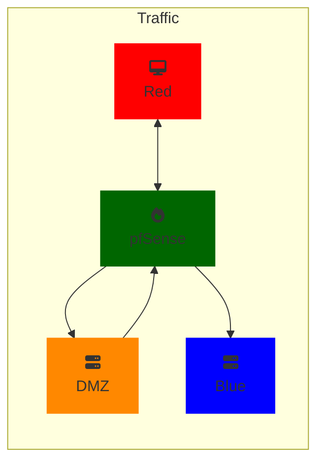

```mermaid
flowchart TD

classDef red stroke:#f00,fill:#f00
classDef blue stroke:#00f,fill:#00f
classDef dmz stroke:#F80,fill:#F80
classDef infra stroke:#060,fill:#060

subgraph Red
K[fas:fa-desktop \n Kali]:::red
end

subgraph Infra
Pf[fas:fa-fire \n pfSense]:::infra
end

subgraph Blue
W[fas:fa-server \n Wazuh]:::blue
M[fas:fa-desktop \n Linux Mint]:::blue
Ma[fas:fa-server \n Mail Server]:::blue
M <--> W
W --> Ma --> M
end

subgraph DMZ
Mi[fas:fa-server \n Minotaur]:::dmz
Si[fas:fa-server \n Simple]:::dmz
Bl[fas:fa-server \n Blue]:::dmz
end

I[fas:fa-cloud \n Internet]

subgraph Network
I <--> Infra
Infra <--> Blue
Infra <--> Red
Infra <--> DMZ

Mi --> W
Si --> W
Bl --> W
end
```

```mermaid
flowchart LR
classDef red stroke:#f00,fill:#f00
classDef blue stroke:#00f,fill:#00f
classDef dmz stroke:#F80,fill:#F80
classDef infra stroke:#060,fill:#060

K[fas:fa-desktop \n Red]:::red

Dm[fas:fa-server \n DMZ]:::dmz


Pf[fas:fa-fire \n pfSense]:::infra

Bl[fas:fa-server \n Blue]:::blue

subgraph Traffic
K <--> Pf --> Dm --> Pf --> Bl
end
```