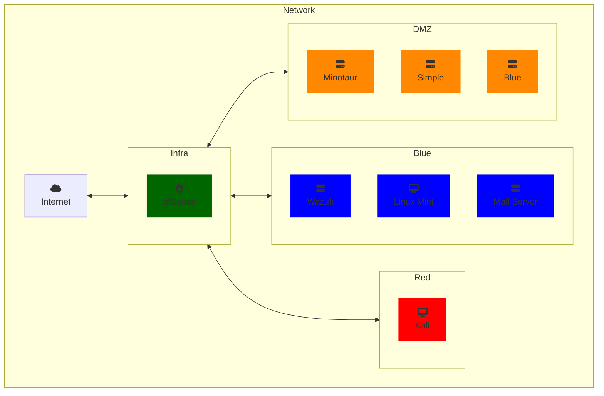

# Incident Response Project   Cyber Range

## Table Of Contents

### Purpose

I'm currently studying a Certificate IV in Cybersecurity and for the Cluster course "Cyber Incident Response Threat Cluster" (VU23220 VU23221)
We have been tasked with creating an Incident Response Exercise(IRx).

This document will hopefully serve a howto guide on how i setup the network for our IRx.

### Requirements
### Resources
#### Host System
* Host Computer: Asus TUF Gaming A15 (fa506iu)
    * CPU: Ryzen 7 4800h (8 Core, 16 Thread)
    * RAM: 64gb DDR4 3200mhz (Corsair Vengenace SODIMM)
    * HDD1: 512GB M.2 SSD
    * HDD2: 1TB Sata SSD
    * OS: Windows 10 Pro (22H2)
    * Virtualisztion: Oracle Virtual Box

#### Virtual Machines

| VM Name | 💿 ISO | 🖥️ OVA | Role |
| --- | --- | --- | --- |
| pfSense | [💿 ISO](https://www.pfsense.org/download/) | | Tools|
| Debian 12 | [💿 ISO](https://www.debian.org/download) | [🖥️ OVA](https://www.linuxvmimages.com/images/debian-12/) | Tools|
| Wazuh 4.6.0| | [🖥️ OVA](https://documentation.wazuh.com/current/deployment-options/virtual-machine/virtual-machine.html) | Blue |
| Linux Mint |[💿 ISO](https://www.linuxmint.com/download.php) | [🖥️ OVA](https://www.osboxes.org/linux-mint/) | Blue |
| Vuln Hub Machines | |[🖥️ OVA](https://www.vulnhub.com) | DMZ |
| Kali 2024.1 | [💿 ISO](https://www.kali.org/get-kali/#kali-installer-images) | [🖥️ OVA](https://www.kali.org/get-kali/#kali-virtual-machines)| Red |

#### Network Map:

## Setup

The steps for setting up the above network should work on either VMware or VirtualBox, but as i am using VirtualBox in my setup, the instructions will only be for it.
(There maybe a follow-up guide for setting this up on Proxmox)

1. [Install Virualbox](https://www.virtualbox.org/manual/UserManual.html#installation)
2. Download required ISO or OVA files

### Network

#### pfsense

**pfSense Setup**

Follow the [install guide](https://docs.netgate.com/pfsense/en/latest/install/index.html)

**pfSense Config**

We'll use 2 CPU Cores and 4GB (4096 MB) RAM and for this setup we will be using 4 Virtual Network Interfaces (vtnet) as detailed below:

| vtnet | Type | Driver | Subnet | Description |
| :---: | --- | --- | --- | --- |
| 1 | Bridged or NAT | Paravirtualised | dhcp | WAN interface
| 2 | Internal Network (intnet) | Paravirtualised | 192.168.1.1/24 | LAN Interface
| 3 | Internal Network (intnet-DMZ)| Paravirtualised | 192.168.56.1/24 | DMZ Interface
| 4 | Internal Network (intnet-EXT)| Paravirtualised | 172.16.0.1/24 | EXTNET Interface (fake WAN)

**Firewall Rules**

pfSense by Default has a *Default Deny* rule whereby all traffic is blocked unless explicitly allowed, the following rule allow traffic.
They are set as wide as possible but can be tightened if required (or want a challenge :P)

*Allow Rules*

|**Interface** | **Source** | **Destination** | **Protocol** | **Comment** |
| :---: | :---: | :---: | :---: | :---: |
| DMZ | DMZ | LAN | ALL |
| DMZ | DMZ | EXT | ALL |
| DMZ | DMZ | WAN | ALL | *Temp Rule*\*
| EXT | EXT | DMZ | ALL |
| EXT | EXT | WAN | ALL |
| LAN | LAN | WAN | ALL |
| LAN | LAN | WAN | ALL |

\* *After setup completed this rule is disabled or deleted*

### Blue Team
#### SEIM: Wazuh

Follow the [install guide](https://documentation.wazuh.com/current/deployment-options/virtual-machine/virtual-machine.html)

We'll hold off on setting up the agents until later.

#### Linux Mint

We'll use this machine as the Config Machine & later during the IRx as the Blue team monitoring Box.

#### Debian 12 - Mail Server

### Red Team
#### Kali

Follow the [install guide]()

## Configuration

## Usage

### Virtual Machine Info

**Boot order**

    1. Pfsense
    2. Tinymail
    3. Wazuh
    4. Linux Mint
    5. Vulnerable Machines
    6. Kali
    
**Passwords**
|Machine | User | Pass |
| :---: | :---: | :---: |
| Pfsense | Admin |pfsense |
| TinyMail | John117 | John117 |
| Wazuh | admin | admin |
| Mint | Osboxes.org | Osboxes.org |
| Kali | kali | kali |

## Acknowledgements

        
